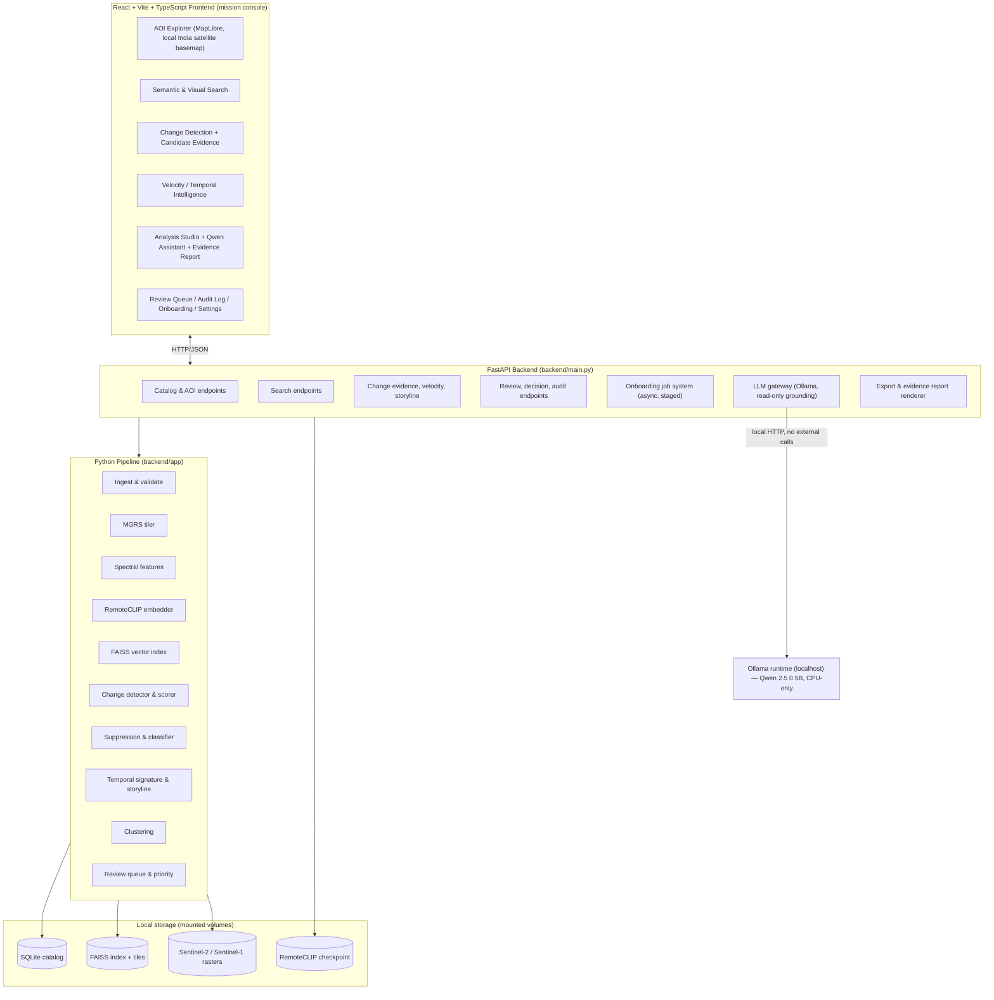
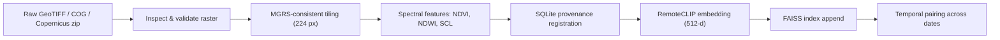
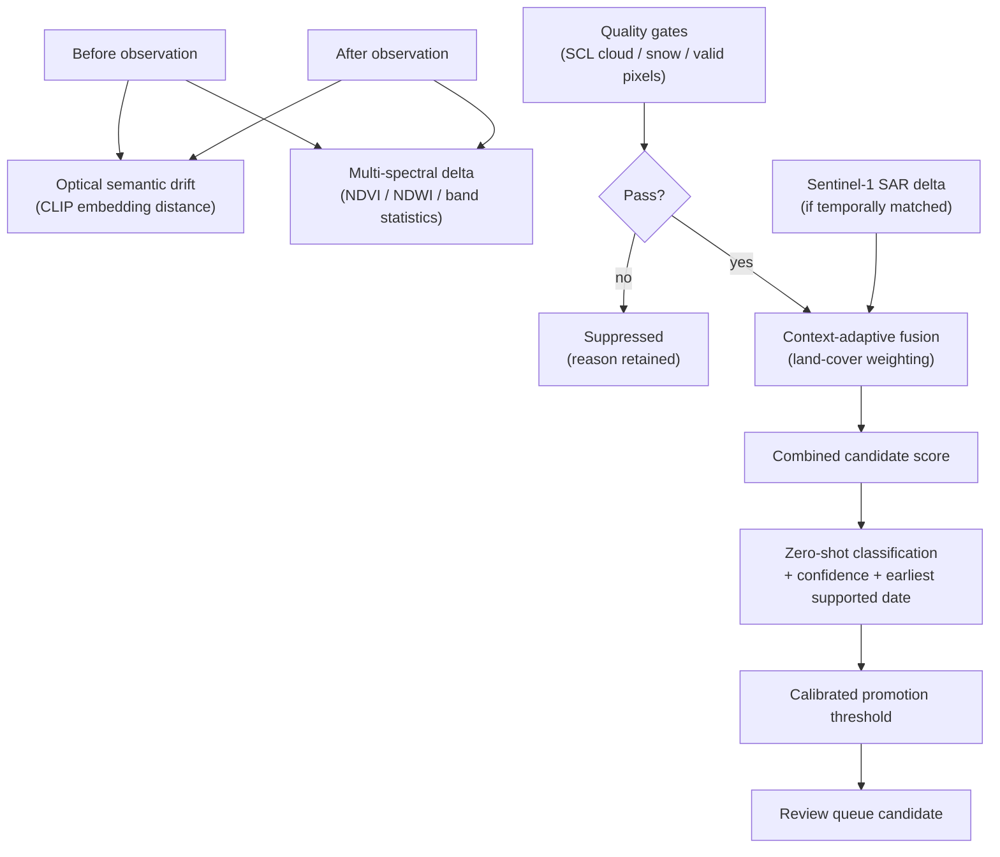
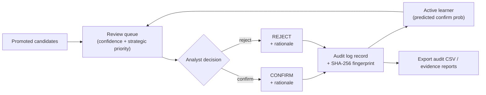
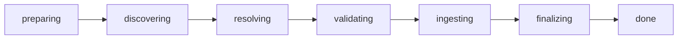

# GeoSpectra — Architecture Documentation

**Semantic Retrieval and Multi-Temporal Change Analysis of Satellite Imagery**
Smart India Hackathon 2026 · Problem Statement 26227 · Team QuantumCore (IIC_TMSL_P6_S21)

This document describes the complete, current architecture of GeoSpectra: the
ingestion pipeline, semantic retrieval subsystem, multi-temporal change
analysis, quality and false-alarm suppression, Sentinel-1 SAR evidence layer,
temporal intelligence (velocity / acceleration / storyline), discovery
clustering, the AOI Explorer geospatial map, the grounded on-device Qwen
analyst assistant, the analyst evidence report, the human-in-the-loop review
workflow with SHA-256 audit fingerprints, and the incremental onboarding
pipeline — all operating fully offline on commodity CPU hardware.

Related documents: `PROJECT_WORKFLOW.md` (index build & ingestion procedure),
`docs/EVALUATION.md` (reproducible evaluation report), `docs/PROVENANCE.md`
(model & dataset provenance), `PERFORMANCE_REPORT.md` and
`FINAL_VALIDATION_REPORT.md` (measured performance and validation evidence).

---

## 1. Executive Summary

GeoSpectra is an analyst-oriented, on-premises satellite intelligence platform
built around real, locally stored satellite imagery. Its core capability is
the combination of:

- **Semantic retrieval** over real satellite tiles using a shared image/text
  embedding space (RemoteCLIP ViT-B/32, 512-d), served by a FAISS vector index;
- **Multi-temporal change analysis** that fuses optical semantic drift with
  multi-spectral evidence under quality controls;
- **Sentinel-1 SAR** as independent, cloud-penetrating corroboration;
- **Temporal intelligence** — velocity, acceleration and storylines that turn
  pairwise detections into rates and trends;
- **Human-in-the-loop review** with a ranked queue, confirm/reject decisions,
  feedback-informed reranking, and a tamper-evident SHA-256 audit trail;
- **A grounded on-device Qwen 2.5 assistant** that answers from measured facts
  and refuses to over-claim, with a deterministic fallback;
- **One-click analyst evidence reports** (PDF/JSON) generated locally with full
  source-scene provenance;
- **Incremental onboarding** of new areas through a live, staged pipeline with
  duplicate detection — no index rebuild;
- **Complete offline operation**: no cloud services or external APIs are called
  after models and data are staged locally.

Every number the system displays is measured from the actual catalog. Where
evidence is unavailable, the system says so.

## 2. Problem Definition and Objectives

Earth-observation archives are expanding rapidly, but conventional catalogues
are searchable only by metadata (coordinates, date, platform). Analysts must
already know where and when to look. The problem statement requires an
operational system that makes an archive queryable **by meaning** and **by
change over time**, while remaining on-premises, incrementally ingestible,
provenance-preserving, and robust to false change from season, atmosphere,
viewing geometry, registration error and sensor differences.

GeoSpectra's objectives map one-to-one onto the six required capabilities:

| PS capability | GeoSpectra implementation |
|---|---|
| 2.2.1 Semantic & multimodal retrieval | `/search/text` + `/search/image` over RemoteCLIP + FAISS, ranked, AOI/date/K filters |
| 2.2.2 Multi-temporal change analysis | hybrid scoring, zero-shot classification, earliest supported observation, velocity |
| 2.2.3 False-alarm suppression | SCL/quality gates, calibrated thresholds, seasonal trajectories, SAR corroboration |
| 2.2.4 Discovery & clustering | embedding-based clustering + similar-tile branching |
| 2.2.5 Analyst workflow & provenance | review queue, confirm/reject + rationale, SHA-256 audit log, evidence reports, learner reranking |
| 2.2.6 Scale, incremental ingestion, sovereignty | FAISS append, staged onboarding with dedup, offline enforced, GeoTIFF/COG |

## 3. Overall System Architecture

The system comprises three layers, packaged as one CPU Docker container:

**Sovereignty model:** after the RemoteCLIP checkpoint, Qwen weights and
imagery are staged locally, the system runs with network access disabled.
Offline execution is enforced in the application settings — it is a stated
runtime property, not an assumption.

## 4. Module Map (verified source tree)

| Module | Role |
|---|---|
| `backend/app/pipeline/ingest.py` | scene ingestion: validation, tiling, features, registration, embedding, indexing |
| `backend/app/pipeline/batch_validate.py` | batch validation of Copernicus archives / GeoTIFF folders |
| `backend/app/pipeline/onboard_aoi.py` | staged AOI onboarding: discovery → resolution → validation → ingestion → finalization, with per-scene and per-stage callbacks |
| `backend/app/geospatial/reader.py` | raster reading (GeoTIFF/COG), CRS/transform validation |
| `backend/app/geospatial/tiler.py` | MGRS-consistent tiling (224 px ≈ 2.24 km footprint at 10 m) |
| `backend/app/geospatial/features.py` | NDVI, NDWI, SCL/cloud/water quality features |
| `backend/app/geospatial/catalog_db.py` | SQLite catalog, provenance, `record_decision` with SHA-256 fingerprint |
| `backend/app/geospatial/scene_stack.py` | per-tile observation stacks |
| `backend/app/geospatial/copernicus_metadata.py` | Copernicus archive metadata extraction |
| `backend/app/geospatial/rendering.py`, `sar_rendering.py` | imagery & SAR rendering primitives |
| `backend/app/embeddings/clip_embedder.py` | RemoteCLIP ViT-B/32 embedding (512-d) |
| `backend/app/index/vector_index.py` | FAISS ID-mapped index; incremental append |
| `backend/app/index/search.py` | vector similarity search (text & image queries) |
| `backend/app/index/remoteclip_migration.py` | checkpoint staging/migration utilities |
| `backend/app/change/detector.py` | temporal pairing & hybrid change scoring |
| `backend/app/change/adaptive.py` | context-adaptive weighting of semantic vs spectral signals |
| `backend/app/change/classifier.py` | zero-shot change-type classification (CLIP) |
| `backend/app/change/calibration.py` | promotion-threshold calibration |
| `backend/app/change/fusion.py` | optical/SAR fusion with rescue guard |
| `backend/app/change/sar.py` | SAR change evidence branch |
| `backend/app/change/heatmap.py` | difference heatmaps / masks |
| `backend/app/change/temporal_signature.py` | velocity, acceleration, temporal signature classes |
| `backend/app/change/storyline.py` | classified storyline stages (short/seasonal) |
| `backend/app/change/landcover.py` | heuristic land-cover context |
| `backend/app/change/priority.py` | strategic priority (AOI tier, GeoJSON zones, hotspot proximity) |
| `backend/app/change/reranker.py` | review ordering (legacy-compatible helper; production ordering in `review/queue.py`) |
| `backend/app/change/llm_brief.py` | Ollama/Qwen grounded analyst brief |
| `backend/app/change/analyst_chat.py` | grounded multi-turn analyst chat |
| `backend/app/change/brief.py`, `narrative.py` | deterministic summaries & narratives |
| `backend/app/change/evidence_report.py` | analyst evidence report (PDF/JSON) |
| `backend/app/discovery/clustering.py` | embedding-based clustering of tiles |
| `backend/app/review/queue.py` | analyst triage & review queue ordering |
| `backend/app/cli.py` | operational CLI (ingest, cluster, velocity, SAR onboarding) |
| `backend/main.py` | FastAPI application (~50 endpoints, async onboarding jobs) |
| `backend/rendering.py` | thumbnails, mosaics, pixel-change maps, difference images |

## 5. Technology Stack

| Layer | Technology | Role |
|---|---|---|
| Satellite data | Sentinel-2 L2A, Sentinel-1 GRD (VV/VH) | real imagery, staged locally |
| Raster processing | Rasterio, NumPy | GeoTIFF/COG reading, masking, statistics |
| Spatial normalization | common CRS + MGRS-consistent tile identity | physical temporal correspondence |
| Optical features | NDVI, NDWI, SCL | vegetation/water context and quality gates |
| Semantic embeddings | RemoteCLIP ViT-B/32 (512-d) | shared image/text representation |
| Vector search | FAISS (ID-mapped, L2) | similarity retrieval, incremental append |
| Catalog | SQLite (additive migrations; PostgreSQL+PostGIS path documented) | provenance & metadata |
| On-device LLM | Qwen 2.5 0.5B via Ollama (CPU) | grounded analyst assistant |
| Backend | FastAPI (Python) | API layer, job system, export |
| Frontend | React 18, Vite, TypeScript, Tailwind CSS, Radix UI, TanStack Query, Recharts, MapLibre GL | mission-console analyst workspace |
| Geospatial UI | MapLibre GL + local India satellite basemap raster | offline AOI Explorer |
| Testing | pytest (regression suite), Playwright (browser suite) | pipeline & route verification |
| Packaging | Docker, docker-compose | single CPU container, mounted `data/` + `models/` |

## 6. Data Ingestion and Geospatial Preprocessing

1. **Inspect and validate** — readable raster structure, CRS, transform and
   resolution are checked before anything is accepted; invalid scenes are
   rejected with reasons.
2. **Tile** — scenes are split into fixed-size tiles on a shared spatial grid
   so that the same ground cell is comparable across dates and sensors.
3. **Features** — per-tile NDVI/NDWI and SCL-derived cloud/snow/shadow/valid
   pixel fractions are computed and stored.
4. **Register** — scene and tile provenance (source path, acquisition date,
   sensor, bounding box) is written to the SQLite catalog.
5. **Embed & index** — each tile's RGB representation is embedded with
   RemoteCLIP and appended to the FAISS index. The index is never rebuilt for
   new data; vectors are appended, keyed to catalog rows.

The semantic branch consumes an RGB-like representation; the full multispectral
cube remains available to the physical-evidence and quality paths.

## 7. Semantic and Multimodal Retrieval

- **Text query search** (`POST /search/text`): the natural-language query is
  encoded by RemoteCLIP's text tower; FAISS retrieves the nearest tile vectors
  by cosine similarity. No keyword tags, manual labels or task-specific
  training are involved.
- **Image chip search** (`POST /search/image`): a 224×224 RGB reference chip
  is embedded in the same space; retrieval returns visually and semantically
  similar locations across the archive.
- **Ranking and filters**: results are rank-ordered by similarity and can be
  refined by AOI, date range and top-K, alongside conventional metadata
  filters.
- **Similar-tile branching**: `/tiles/{id}/similar` and before/after-tile
  similarity galleries let an analyst branch from any result to comparable
  locations — discovery without constructing a new query.

## 8. Multi-Temporal Change Analysis

For each ground cell, consecutive observations are paired and scored by a
**hybrid signal**:

- **Semantic drift** captures appearance/disappearance/structural modification
  even when spectra shift subtly; **spectral delta** captures physical
  land-cover transitions.
- **Adaptive weighting** (`change/adaptive.py`) re-balances the two signals by
  land-cover context (e.g. urban/bare vs water).
- **Zero-shot classification** labels supported change types — construction,
  vegetation clearance, water-extent variation, road development — with an
  explicit confidence, and reports the **earliest supported observation** at
  which the change is backed by usable imagery.
- **Calibration** (`change/calibration.py`) sets the promotion threshold from
  data rather than a fixed magic number, favouring analytically useful
  precision over indiscriminate recall.

## 9. False-Alarm Suppression and Quality Handling

Seasonality, clouds, haze, snow, shadows, radiometric inconsistency and
co-registration error are treated as confounds, not as change:

- SCL-based quality gates compute cloud/snow/valid-pixel fractions for **both**
  observations; failing candidates are suppressed before reaching the analyst.
- Per-candidate **historical NDVI/NDWI trajectories** are plotted across all
  ingested scenes for the tile, separating seasonal cycles from structural
  change.
- **SAR rescue guard** (verified in `FINAL_VALIDATION_REPORT.md`): a valid,
  temporally matched SAR observation with a low SAR score does **not** bypass
  optical quality suppression — SAR can corroborate, never smuggle through, a
  bad pair.
- Suppression is transparent: suppressed candidates remain inspectable with
  the reason attached (`source_imagery_unavailable_before`, cloud fraction
  gates, etc.).

On the current archive this discipline is measurable: of 830 scored temporal
pairs, roughly 719 were suppressed by quality gates and 111 promoted.

## 10. Sentinel-1 SAR Evidence Layer

The SAR branch is intentionally **independent of RemoteCLIP**. Scope is
Sentinel-1 VV/VH **backscatter delta** evidence for GRD / monthly-mosaic
products — it is *not* interferometric coherence or InSAR.

Verified real-data validation (see `FINAL_VALIDATION_REPORT.md`):

- Real Planetary Computer `sentinel-1-rtc` GRD products ingested through
  `onboard_aoi_sar`; linear-to-dB conversion performed exactly once
  (`10·log10`), EPSG:32642 at 10 m.
- Temporal matching by physical tile footprint; SAR observations registered
  (390 rows) and fused into candidate scoring with quality and temporal-match
  guards.
- Where SAR is unavailable for a tile, the UI states that SAR evidence is
  unavailable — no values are fabricated.

## 11. Temporal Intelligence: Velocity, Acceleration, Storyline

`change/temporal_signature.py` turns sequences of pairwise changes into rates:

- **Velocity** — score per day computed across actual acquisition intervals
  (`/changes/velocity`);
- **Acceleration** — second-order trend;
- **Signature classification** — each tile is classified as *accelerating*,
  *steady change*, or *stable/decelerating*;
- **Storyline** (`change/storyline.py`) — classified short-term/seasonal
  storyline stages per tile;
- **Temporal evolution & series** endpoints expose full per-tile histories
  for the Analysis Studio.

This extends detection from "what changed" to "how fast", separating sudden
events from gradual structural growth.

## 12. Discovery Clustering

`discovery/clustering.py` groups tiles with cohesive embedding signatures
(HDBSCAN-style density grouping over the indexed RemoteCLIP vectors, persisted
per tile). Analysts who identify one location of interest can sweep every
location with comparable visual/semantic characteristics via
`/clusters/{id}/members` galleries, without a new query.

## 13. AOI Explorer — India-Level Geospatial Map

`frontend/src/components/aoi-explorer/AOIExplorer.tsx` (MapLibre GL):

- A **local India satellite basemap** (bundled raster asset, no tile server,
  no keys) renders the national view fully offline; a dark fallback style is
  used if the asset is unavailable.
- **AOI markers** are placed from the catalog's real data (`/aois` returns
  each AOI's bounding box, tile/scene counts and mosaic thumbnail URL).
- **Hover** shows a preview card (tiles, scenes, observation history span,
  sensor); **click** flies the map into the AOI's *actual observed footprint*
  derived from real tile footprints, overlaying the latest mosaic.
- Markers navigate directly into the AOI's detail pages — analysis begins
  from geography, not from a form. The basemap is a non-authoritative visual
  backdrop; authoritative geometry always comes from the backend catalog.

## 14. Qwen Analyst Assistant (On-Device, Grounded)

The assistant (`change/llm_brief.py`, `change/analyst_chat.py`, endpoints
`POST /tiles/{id}/analysis/brief` and `/analysis/chat`) runs a local Qwen 2.5
0.5B model through Ollama on CPU:

- **Grounding**: the model receives only structured facts already computed by
  the deterministic system (scores, NDVI/NDWI deltas, SAR status, dates).
- **Guards**: prompts prohibit invented numbers, dates, coordinates, confidence
  values and operational recommendations; a numeric guard rejects outputs
  containing unsupported numbers; catalog access is read-only.
- **Honesty by design**: asked whether a change is significant, the assistant
  answers that the evidence alone cannot establish significance, rather than
  inventing certainty.
- **Deterministic fallback**: if Ollama or the model is unavailable, the
  system degrades to a deterministic, rule-based summary — it never guesses.

## 15. Analyst Evidence Report

`change/evidence_report.py` + `POST /tiles/{id}/analysis/report` generate a
one-page dossier locally (PDF via Pillow, or JSON):

- before/after imagery figures, spectral evidence tables (index, before, after,
  delta), temporal evidence (observation count, interval, velocity,
  acceleration, trend), SAR status, limitations, and the analyst summary;
- generated on the fly from the local catalog with full source-scene and
  processing provenance; nothing is uploaded.

## 16. Analyst Workflow, Active Learning and Audit

- **Review queue** (`review/queue.py`, `change/priority.py`): triage by
  confidence and strategic priority (analyst-configured AOI tiers, optional
  GeoJSON priority zones, proximity to confirmed hotspots). Priority reorders
  candidates; it never silently drops them.
- **Decisions**: `POST /review/{candidate_id}/decision` with optional analyst
  rationale; `record_decision` in `catalog_db.py` persists the decision and
  computes a **SHA-256 record fingerprint** over the decision record.
- **Audit trail**: `GET /review/audit-log` returns every decision with
  timestamp, rationale and fingerprint; exportable as CSV. Fingerprint
  verification is read-time and recomputed — verifiable, exportable provenance.
- **Feedback-informed reranking**: analyst decisions feed a lightweight active
  learner whose predicted-confirm probability reorders the queue as the
  analyst works.

## 17. Incremental Onboarding Pipeline

`POST /aois/onboard` starts an **asynchronous job** (in-process job registry
with status polling at `GET /aois/onboard/{job_id}`):

- Each stage and each scene emit progress callbacks (`on_stage`,
  `on_scene_done`); the UI shows a live scene table (accession, date, status)
  with per-scene outcomes including `skipped_duplicate`.
- **Deduplication**: scenes already in the catalog are recognized and skipped
  — re-ingestion never double-counts (verified live: a demo folder of three
  scenes onboards end-to-end in seconds with all three skipped as duplicates).
- **No rebuild**: tiles are embedded and appended to the FAISS index and
  catalog without reprocessing the archive.
- A **live onboarding demo** panel drives the same real pipeline with a demo
  folder, proving (not claiming) incremental ingestion.

## 18. API Surface (verified endpoints)

| Group | Endpoints |
|---|---|
| System | `GET /health`, `GET /stats`, `GET /system/llm-status` |
| Catalog & AOIs | `GET /aois`, `GET /aois/{id}/tiles`, `GET /aois/{id}/timeline`, `GET /aois/{id}/mosaic`, `GET /aois/{id}/narrative` |
| Tiles & analysis | `GET /tiles/{id}`, `GET /tiles/{id}/observations`, `GET /tiles/{id}/analysis`, `GET /tiles/{id}/analysis/series`, `GET /tiles/{id}/similar`, `GET /vectors/{id}/similar`, `GET /tiles/compare` |
| Temporal intelligence | `GET /changes/velocity`, `GET /tiles/{id}/temporal-signature`, `GET /tiles/{id}/temporal-evolution`, `GET /tiles/{id}/storyline` |
| Search | `POST /search/text`, `POST /search/image`, `POST /preview/image` |
| Change analysis | `GET /changes/candidates`, `GET /changes/candidates/data-quality`, `GET /changes/priority`, `POST /changes/recompute-priority`, `GET /changes/{id}`, `GET /changes/{id}/explanations`, `POST /changes/{id}/brief` |
| Calibration | `POST /calibration/run`, `GET /calibration/results` |
| Review & audit | `POST /review/{id}/decision`, `GET /review/audit-log`, `GET /export` |
| AI assistant & reports | `POST /tiles/{id}/analysis/brief`, `POST /tiles/{id}/analysis/chat`, `POST /tiles/{id}/analysis/report` |
| Clustering | `GET /clusters`, `GET /clusters/{id}/members` |
| Onboarding | `POST /aois/onboard`, `GET /aois/onboard/{job_id}` |
| SAR | `POST /sar/observations`, `GET /sar/observations` |

## 19. Data Model (logical entities)

| Entity | Key information |
|---|---|
| `aois` | name/slug, bounding box (derived from real tile footprints), tile/scene counts, priority tier |
| `scenes` | source path, sensor, acquisition date, Copernicus metadata, chips extracted |
| `tiles` | MGRS-consistent spatial identity, source path, dates, spectral features, land-cover context, temporal summary fields |
| vector index entries | 512-d RemoteCLIP embeddings, ID-mapped to tiles |
| `change_candidates` | evidence scores, modality, SAR/fusion values, priority, classification, heatmap/mask artifacts, storyline |
| decisions / audit log | candidate, decision, analyst rationale, timestamp, SHA-256 record fingerprint |
| `sar_tiles` / SAR observations | VV/VH dB features, sensor/product provenance, temporal match info |
| onboarding jobs | job id, AOI, stage, per-scene outcomes (ingested / skipped_duplicate / failed) |

Migrations are additive; new fields are optional so older frontend or database
paths do not break.

## 20. Frontend Architecture

React 18 + Vite + TypeScript SPA (Tailwind CSS, Radix UI primitives, TanStack
Query for data fetching with polling, Recharts for signal charts, MapLibre GL
for the AOI Explorer). Verified pages:

| Page | Purpose |
|---|---|
| `SignInPage` | mission-console entry |
| `DashboardPage` | live catalog & surveillance stats (all values from `/stats`, never hardcoded) |
| `AOIPage` + `AOIExplorer` | India-level satellite map, AOI markers, fly-to real footprints |
| `AOIDetailPage` | scene ingestion & provenance timeline, mosaic, per-AOI tiles |
| `SearchPage` | text & image-chip semantic search with filters and result comparison |
| `ChangesPage`, `ChangeDetailPage` | candidate surveillance grid & full evidence chain (heatmap → mask → SAR → velocity) |
| `VelocityPage` | change velocity monitor, temporal activity matrix, tile history, compare-any-two-dates |
| `AnalysisStudioPage` | any-two-date analysis, signal charts, analyst remark, Qwen assistant, evidence report export |
| `TileDetailPage` | tile spectral signature, nearest visual neighbours, provenance |
| `ReviewQueuePage` | human-in-the-loop triage with confirm/reject + rationale |
| `ClustersPage`, `ClusterDetailPage` | discovery clustering galleries |
| `OnboardPage` | incremental onboarding form + live demo panel with staged progress |
| `AuditLogPage` | decision audit trail with SHA-256 fingerprints, CSV export |
| `SettingsPage` | backend/model inspection; **offline execution mode: enforced (no external LLM / cloud calls)** |

## 21. Deployment and Sovereignty

- **Packaging**: single Docker container (backend + built frontend served by
  FastAPI); `docker-compose.yml` mounts `data/` and `models/` externally.
- **Offline enforcement**: the settings page surfaces the runtime contract —
  API base local, offline execution enforced, Ollama reachable locally, no
  external LLM/cloud calls.
- **Hardware**: CPU-only; no GPU required. Measured latencies and hardware are
  recorded in `docs/EVALUATION.md` and `PERFORMANCE_REPORT.md`.
- **Scale path**: SQLite → PostgreSQL + PostGIS; FAISS flat → IVF/HNSW for
  approximate search at national scale; ingestion scales through the same
  incremental onboarding pipeline.

## 22. Validation State

Evidence in `FINAL_VALIDATION_REPORT.md` and `PERFORMANCE_REPORT.md`:

- Python regression suite passing (pytest, including focused velocity, LLM,
  discovery and SAR tests); production frontend build (Vite/TypeScript)
  succeeds.
- Playwright browser suite covers all declared routes, reload and back/forward
  navigation, rendered content, console/page errors, HTTP 5xx, the SAR-backed
  candidate workflow, and the dashboard → AOI → search → tile → velocity →
  change → discovery flow.
- Real Sentinel-1 GRD ingestion and optical/SAR fusion verified on real
  products, including the SAR rescue-guard behaviour (low-scoring SAR does not
  bypass optical quality suppression).
- On-device Qwen verified end-to-end with numeric and domain-grounding guards
  active; deterministic fallback tested.
- Dashboard values are rendered from `/stats` — nothing is hardcoded.

## 23. Known Limitations and Scope Honesty

- Zero-shot change-type classification is a candidate interpretation, not
  ground truth.
- Land-cover classification is heuristic (spectral context), not a supervised
  land-cover product.
- SAR backscatter delta is not interferometric coherence and is not described
  as such; fuller SAR fusion awaits value-range and co-registration
  validation.
- MGRS tiling provides spatial grouping but does not guarantee pixel-level
  cross-sensor co-registration; SAR matching is by physical tile footprint and
  temporal compatibility.
- Semantic search uses an RGB-like representation; the multispectral cube is
  reserved for physical evidence and quality analysis.
- The assistant reports measured facts; it explicitly declines to establish
  significance or causation the evidence cannot support.

## 24. Demonstration Flow (as recorded)

Dashboard → AOI Explorer (India map → fly-to real footprint) → tile spectral
signature & provenance → semantic text search ("water body expansion") →
image-chip search → change candidate evidence chain (heatmap → mask → SAR →
velocity) → human review with reject + rationale → velocity monitor & tile
history → Analysis Studio (any two dates, signals) → analyst remark → Qwen
assistant (summarize; "is it significant?" → honest refusal) → evidence report
export → clusters → live incremental onboarding (stages, duplicates skipped)
→ audit log with SHA-256 fingerprints → settings (offline enforced).

---

*GeoSpectra — semantic retrieval, multi-temporal change analysis, human-verified
evidence: completely offline, on commodity hardware.*
